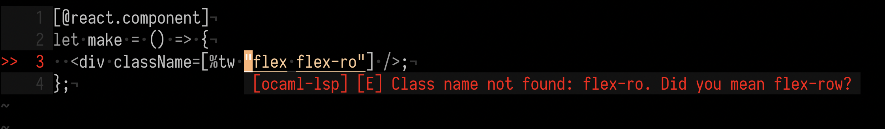
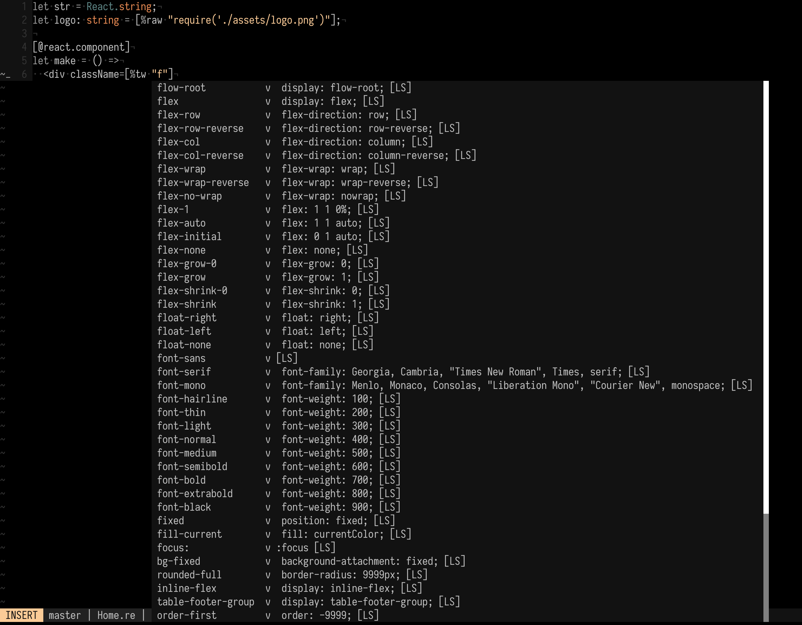

# tailwind-ppx
[](https://github.com/dylanirlbeck/tailwind-ppx/actions)
[](https://badge.fury.io/js/%40dylanirlbeck%2Ftailwind-ppx)
[](#contributors-)

Reason/OCaml [PPX](https://blog.hackages.io/reasonml-ppx-8ecd663d5640) for writing compile-time validated Tailwind CSS classes.

<p align="center"></p>

## Table of Contents

- [Features (Current and Upcoming)](#features)
- [Usage](#usage)
- [Configuration](#configuration)
- [Installation](#installation)
- [Frequently Asked Questions (FAQ)](#faq)
- [Developing](#developing)
- [Contributors](#contributors-)
- [Examples and Related Projects](#other)

## Features

**Current**

- Checks for invalid class names (and suggestions for valid ones!)
- Checks for duplicate class names
- Always in-sync with your `tailwind.css` file (just make sure to re-build!)
- [Automatic purging of unused class names](#getting-ready-for-production) (with PurgeCSS and `tailwind-ppx`'s custom extractor function)
- [Ships with an integration script](#integration-script) that converts all your
  existing `className="..."` to `className=[%tw "..."]`

**Upcoming**

- [Better integration with PostCSS](https://github.com/dylanirlbeck/tailwind-ppx/issues/62)
- Redundant class names (like having both `flex-row` and `flex-col`)
- Class name dependencies (like having `flex-row` without `flex`)

If you have ideas for new features, please [open an issue](https://github.com/dylanirlbeck/tailwind-ppx/issues)!

## Usage

`tailwind_ppx` implements a ppx (`%tw`) that validates your Tailwind CSS classes at compile time.

For example, for the following (condensed) `tailwind.css` file:

```css
.flex {
  display: flex;
}

.flex-row {
  flex-direction: row;
}
```

`tailwind-ppx` will provide validation for your desired class names. See these
examples:

```reason
// Example 1
<Component className=[%tw "flex flex-row"] /> // This is ok!

// Example 2
<Component className=[%tw "flex flex-ro"] /> // ERROR: Class name not found: flex-ro. Did you mean flex-row?

// Example 3
<Component className=[%tw "flex flex-row flex"] /> // ERROR: Duplicate class name: flex
```

Finally, `tailwind-ppx` requires your **generated** `tailwind.css` file to exist somewhere in the
project hierarchy. Though not required, it's recommended that you [configure the
path](#-path) to your `tailwind.css` file (relative to your project root).

### Getting ready for production

As [outlined in the Tailwind docs](https://tailwindcss.com/docs/controlling-file-size/), when preparing for production you'll want to make sure that the only CSS from Tailwind that ends up in your bundle is CSS that you _actually use_ in your code.

First, take a second to read the [section on setting up Purgecss from the Tailwind docs](https://tailwindcss.com/docs/controlling-file-size/#setting-up-purgecss). In order to help with the process outlined in the docs, this package ships with a default extractor function that'll take care of ensuring that any CSS from Tailwind that you aren't using with this PPX can be purged from your production CSS bundle. You enable it by slightly modifying the official example of how to set up your `postcss.config.js`:

```javascript
// postcss.config.js
const purgecss = require("@fullhuman/postcss-purgecss")({
  // Specify the paths to all ReasonML code where you're using this PPX.
  content: ["./src/**/*.re"],

  // Include the extractor from this package
  defaultExtractor: require("@dylanirlbeck/tailwind-ppx").extractor
});

module.exports = {
  plugins: [
    require("tailwindcss"),
    require("autoprefixer"),
    ...(process.env.NODE_ENV === "production" ? [purgecss] : [])
  ]
};
```

Doing this will ensure that you only ship CSS from Tailwind to production that you're actually using with this PPX.

### Moving or changing your `tailwind.css` file

If your `tailwind.css` file changes (or you move it) you'll need to rebuild your
project - for example, `bsb -clean-world` and `bsb -make-world` if in BuckleScript.
At this time, `tailwind-ppx` does not automatically watch for changes, though this is on
the roadmap.

Alternatively, you can add the following rules to you bsconfig.json to re-trigger builds

```json
{
  "sources": [
    {
      "dir": "src",
      "subdirs": true,
      "generators": [
        {
          "name": "gen-tailwind",
          "edge": ["tailwind.css", ":", "styles.css"]
        }
      ]
    }
  ],
  "generators": [
    {
      "name": "gen-tailwind",
      "command": "tailwindcss build $in -o $out"
    }
  ]
}
```

If you have a custom tailwind config file, you'll need to pass it to the tailwindcss command:

```json
{
  "name": "gen-tailwind",
  "command": "tailwindcss build $in -o $out -c ../../tailwind.config.js"
}
```

You might have to [specify the path to `tailwind.css`](#-path).

### Autocompletion (Neovim only)

If you're a Neovim user, you can download the [`coc-tailwindcss`](https://github.com/iamcco/coc-tailwindcss) extension to get class name autocompletion while using `tailwind-ppx` - just make sure to define a `tailwind.config.js` file. See the example below!



### Ignore `.tailwind_ppx_cache` in your version control

`tailwind-ppx` will generate a `.tailwind_ppx_cache` folder in your project root
to optimize the validation performance. If you're using a version control
system, you don't need to check it in.

## Configuration

### -path

By default, `tailwind-ppx` looks for your `tailwind.css` file in the root
directory. If `tailwind.css` lives elsewhere (or the name of your generated CSS file is different), you'll need to specify the file path in your `bsconfig.json`.

```json
"ppx-flags": [
  ["@dylanirlbeck/tailwind-ppx/tailwind-ppx", "-path ../path/to/tailwind.css",]
],
```

## Installation

The most likely use case for `tailwind-ppx` is inside ReasonReact projects
(using BuckleScript). To get started, we recommend cloning our [demo
project](https://github.com/dylanirlbeck/tailwind-ppx-demo).

### With `yarn` or `npm` on Bucklescript projects (recommended)

Install the PPX with `yarn` or `npm`

```bash
yarn add --dev @dylanirlbeck/tailwind-ppx
# Or
npm install --dev @dylanirlbeck/tailwind-ppx
```

And add the PPX in your `bsconfig.json` file:

```json
{
  "ppx-flags": ["@dylanirlbeck/tailwind-ppx/tailwind-ppx"]
}
```

### Integration script

The `@dylanirlbeck/tailwind-ppx` NPM package ships with an executable that, when
run in a BuckleScript project, turns all instances of `className="..."` into
`className=[%tw "..."]`. The script is designed to make it easy to immediately
introduce `tailwind-ppx` into an existing codebase.

You can use this script by running the following command from the root of your
project (just make sure you've installed the NPM package).

On MacOS/Linux:

```
yarn use-tailwind-ppx
# Or
npx use-tailwind-ppx
```

On Windows:

```
./node_modules/@dylanirlbeck/tailwind-ppx/use-tailwind-ppx.exe
```

> Note that you'll need both a `bsconfig.json` to exist in the project hierarchy
> and compiled project with `bsb -make-world` (so the `lib/` directory exists in
> the project root) for the script to work properly.

## FAQ

- **How can I conditionally add classes?**

  This feature is out of scope for `tailwind-ppx`; instead, we recommend you use
  [`re-classnames`](https://github.com/MinimaHQ/re-classnames) in combination
  with `tailwind-ppx`. See the example below:

  ```reason
  module SomeComponent = {
    [@react.component]
    let make = (~someBool) => {
      let className =
        Cn.(
          [%tw "text-blue-500"]->on(someBool)
          + [%tw "text-gray-500"]->on(!someBool)
        );
      <div className />;
    };
  };
  ```

- **How can I use custom CSS classes?**

  `tailwind-ppx` directly parses your generated `tailwind.css` file, which means
  that **all** CSS classes will be validated by the PPX, including custom class
  names defined in your base `index.css/styles.css` file. In short, if the class
  is in your `tailwind.css` file, it will be validated correctly by the ppx.

  Example:

  ```reason
  <Component className=[%tw "flex flex-row customLayou"] /> // ERROR: Class name not found: customLayou. Did you mean customLayout?
  ```

## Developing

After cloning the repository, you should run both `esy` and `yarn` to install
dependencies. `tailwind-ppx` uses `esy` for managing the important dependencies,
and `yarn` is used solely for pre-commit linting/formatting of Reason files.

### Relevant commands

- `esy build` -> Builds the project
- `esy format` -> Formats the entire project with `ocamlformat` and `refmt`
- `esy watch` -> Watches for changes to Reason/OCaml files in the entire project, including in the `/test` directory
- `esy test_native` -> Runs the native tests (in `test/native`)
- `cd test/bucklescript && yarn test` -> Runs the BuckleScript tests (in `test/bucklescript`)

> Note that if you pull requests are not formatted properly, or the `esy.lock`
> is out-of-date, GitHub actions will automatically format your code by pushing
> up a new commit.

### Releasing

1. Bump the version of the ppx in `esy.json` on `master` (we use [semantic versioning](https://semver.org/))
2. Create and push a new tag

```
$ git checkout master
$ git tag vx.y.z
$ git push origin vx.y.z
```

3. [Create detailed release notes](https://github.com/dylanirlbeck/tailwind-ppx/releases) for the new version, following the `Added/Changed/Fixed/Removed` format. Note that the new version of the PPX will automatically be pushed to NPM and a release will be created on GitHub.

## Contributors ✨

Thanks goes to these wonderful people ([emoji key](https://allcontributors.org/docs/en/emoji-key)):

<!-- ALL-CONTRIBUTORS-LIST:START - Do not remove or modify this section -->
<!-- prettier-ignore-start -->
<!-- markdownlint-disable -->
<table>
  <tr>
    <td align="center"><a href="https://dev.to/dylanirlbeck"><br /><sub><b>Dylan Irlbeck </b></sub></a><br /><a href="https://github.com/dylanirlbeck/tailwind-ppx/commits?author=dylanirlbeck" title="Code">💻</a> <a href="https://github.com/dylanirlbeck/tailwind-ppx/commits?author=dylanirlbeck" title="Documentation">📖</a></td>
    <td align="center"><a href="https://github.com/tatchi"><br /><sub><b>Corentin Leruth</b></sub></a><br /><a href="https://github.com/dylanirlbeck/tailwind-ppx/commits?author=tatchi" title="Code">💻</a> <a href="#ideas-tatchi" title="Ideas, Planning, & Feedback">🤔</a> <a href="#maintenance-tatchi" title="Maintenance">🚧</a></td>
  </tr>
</table>

<!-- markdownlint-enable -->
<!-- prettier-ignore-end -->
<!-- ALL-CONTRIBUTORS-LIST:END -->

This project follows the [all-contributors](https://github.com/all-contributors/all-contributors) specification. Contributions of any kind welcome!

## Other

### Examples

These projects are using `tailwind-ppx` throughout the code base:

- [my-first-pr](https://github.com/dylanirlbeck/my-first-pr)

### Related Projects

The following amazing projects provided a lot of inspiration; I recommend you check them out!

- [ocaml-css-parser](https://github.com/astrada/ocaml-css-parser)
- [styled-ppx](https://github.com/davesnx/styled-ppx)
- [graphql-ppx](https://github.com/reasonml-community/graphql_ppx)

